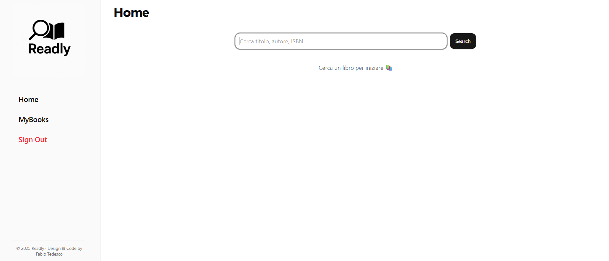
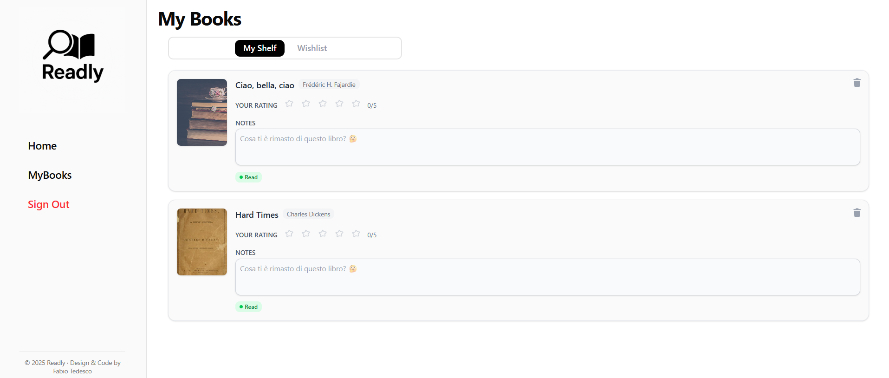

# 📚 Readly

Un'app moderna per **cercare libri online**, salvarli nella tua libreria personale (**MyBooks**) o aggiungerli alla **Wishlist**.  
Readly combina un design minimalista con un backend semplice e sicuro basato su **Supabase**.

<div style="display: flex; gap: 10px;">
  
  
</div>

[Readly](https://readly-demo.vercel.app/)

---

## 🧠 Descrizione

Readly è una web app che consente di cercare libri tramite l’**OpenLibrary API**, visualizzare le informazioni principali (titolo, autore, copertina) e salvarli nella propria libreria digitale o nella wishlist personale.  
L’interfaccia è responsive, pulita e ottimizzata per la leggibilità.

---

## 🚀 Funzionalità principali

✅ **Login / Registrazione** con Supabase  
✅ **Ricerca libri** tramite [OpenLibrary API](https://openlibrary.org/developers/api)  
✅ **Gestione MyBooks e Wishlist**  
✅ **Skeleton Loader** per i caricamenti  
✅ **Gestione errori** con messaggi chiari

📅 **Prossime implementazioni**
- 👤 Sezione profilo utente

---

## 🛠️ Stack Tecnologico

| Tecnologia                    | Descrizione                                                   |
| ----------------------------- | ------------------------------------------------------------- |
| ⚡ **Vite.js**                | Dev server e bundler super veloce                             |
| ⚛️ **React** + **TypeScript** | Framework front-end moderno e tipizzato                       |
| 🎨 **Tailwind CSS**           | Utility-first CSS framework per un design elegante e reattivo |
| 🧭 **React Router**           | Gestione del routing client-side                              |
| 🔄 **React Query**            | Gestione delle query asincrone e caching                      |
| 🔐 **Supabase**               | Autenticazione e backend-as-a-service                         |
| 📚 **OpenLibrary API**        | Fonte dati per i libri                                        |

---

## 🧩 Design

🎨 Design **moderno e minimalista** realizzato con **Tailwind CSS**  
📱 **Responsive** per desktop e mobile  
🌈 Palette colori definita in `tailwind.config.js`:

- `background`: #FAFAFA
- `primary`: #2563EB
- `border`: #E5E5E5
- `card`: #FFFFFF
- `muted-foreground`: #6B7280

💡 Include:

- **Skeleton Loader** per il caricamento delle card
- **ErrorMessage** per la gestione elegante degli errori
- **Radial gradient** e **background dinamici** (es. `bg-login-bg`)

---

## ⚙️ Installazione e avvio

Assicurati di avere **Node.js ≥ 18** installato.

```bash
# Clona il repository
git clone https://github.com/tuo-username/readly.git
cd readly

# Installa le dipendenze
npm install

# Avvia l’ambiente di sviluppo
npm run dev
```
